# Industrial Waste Intelligence

An end-to-end AI platform for industrial waste composition analysis at an incineration facility, combining computer vision, machine learning, LLM-powered insights, and a real-time dashboard into a single production-ready system.

---

## Overview

This system automates the manual process of identifying and tracking waste types from facility images. A waste hauler uploads a photo; the platform instantly classifies each object by type, stores the result, tracks trends over time, predicts future volumes, detects anomalies, and generates daily AI-written operational reports all without human labeling.

**Built for:** Kinsei Sangyo Co., Ltd. (株式会社キンセイ産業), Japan

---

## Key Features

| Layer | What it does |
|---|---|
| **Computer Vision** | Mask R-CNN detects and segments 5 waste classes per image |
| **REST API** | FastAPI serves all data - inference, trend, forecast, anomaly, insights, RAG |
| **ML Forecasting** | XGBoost + Linear Regression predict waste volumes 30 days ahead, tracked with MLflow |
| **Anomaly Detection** | Isolation Forest flags statistically unusual days automatically |
| **LLM Insights** | Ollama (llama3.2:3b) generates daily/weekly operational reports on a schedule |
| **RAG Q&A** | ChromaDB + Ollama answers natural-language questions about facility data |
| **Dashboard** | Streamlit UI with donut/bar/trend/forecast charts, dark theme |
| **Data Pipeline** | PySpark ETL pipeline ingests raw data from GCP Cloud Storage into PostgreSQL |
| **Containerized** | Docker Compose runs the full stack (API + Streamlit + Ollama) with one command |

---

## Tech Stack

**AI / ML**
- PyTorch + torchvision - Mask R-CNN (ResNet-50 FPN backbone)
- scikit-learn - Isolation Forest (anomaly detection), Linear Regression (baseline forecast)
- XGBoost - primary forecast model
- MLflow - experiment tracking & model registry
- Ollama + llama3.2:3b - local LLM (no API key required)
- ChromaDB - vector database for RAG

**Backend**
- FastAPI + Uvicorn
- PostgreSQL (GCP Cloud SQL)
- psycopg2

**Frontend**
- Streamlit
- Plotly

**Data Pipeline**
- Apache PySpark
- Google Cloud Storage

**Infrastructure**
- Docker + Docker Compose
- Python 3.11

---

## Architecture

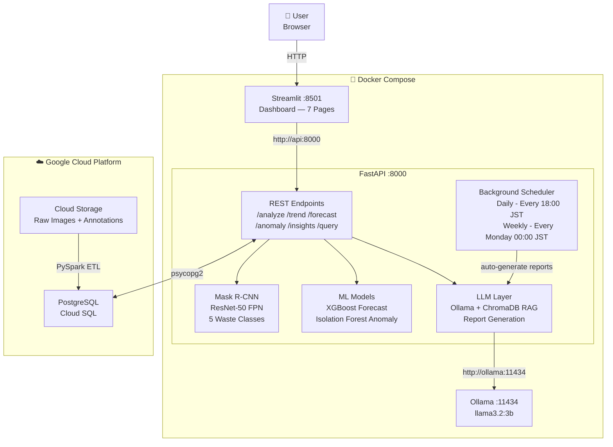

---

## Data Flow & ML Pipeline

### Image Upload → Inference → Dashboard

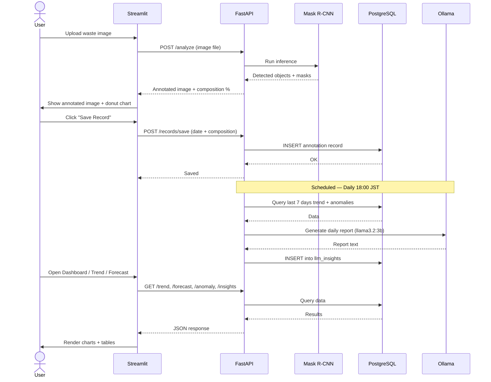

---

### ML Forecast Pipeline

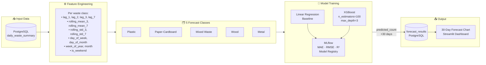

---

## Waste Classes

| Class | Color |
|---|---|
| Metal | Gray |
| Mixed Waste | Orange |
| Paper-Cardboard | Yellow |
| Plastic | Blue |
| Wood | Brown |

---

## API Endpoints

| Method | Endpoint | Description |
|---|---|---|
| GET | `/` | System status + version |
| GET | `/health` | API + DB + model health check |
| POST | `/analyze` | Upload image → run Mask R-CNN inference |
| GET | `/trend` | Historical waste composition by date range |
| GET | `/forecast` | 30-day ahead predictions |
| GET | `/anomaly` | Anomalous days (Isolation Forest) |
| POST | `/anomaly/check` | Run anomaly detection on latest data |
| GET | `/insights` | LLM-generated reports |
| POST | `/insights/generate` | Generate daily/weekly report |
| POST | `/query` | RAG Q&A - natural language query |
| GET | `/records` | Analysis history |
| POST | `/forecast/regenerate` | Re-run forecast from latest data |

Full interactive docs: `http://localhost:8000/docs`

---

## Dashboard Pages

1. **Dashboard** - System status, 30-day trend overview, anomaly count, last upload
2. **Image Analysis** - Upload image, view annotated result, composition breakdown
3. **Trend Analysis** - Line chart per waste class over custom date range
4. **Forecast** - 30-day ML predictions (XGBoost), regenerate on demand
5. **Anomaly Detection** - Isolation Forest results, score chart, anomaly table
6. **AI Insights** - Daily/weekly LLM reports with TREND / ANOMALY / ACTION sections
7. **Ask AI** - Natural language Q&A powered by RAG + Ollama

---

## Screenshots

### Dashboard
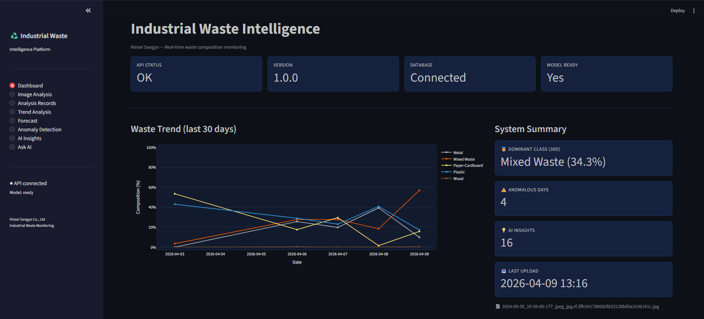

### Image Analysis
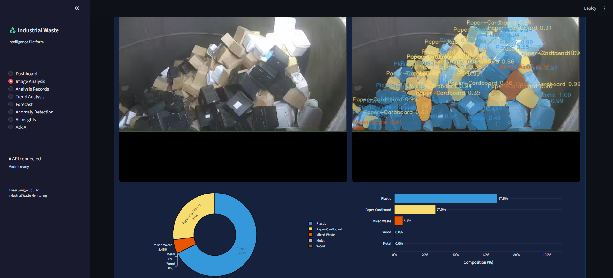

### Analysis Records
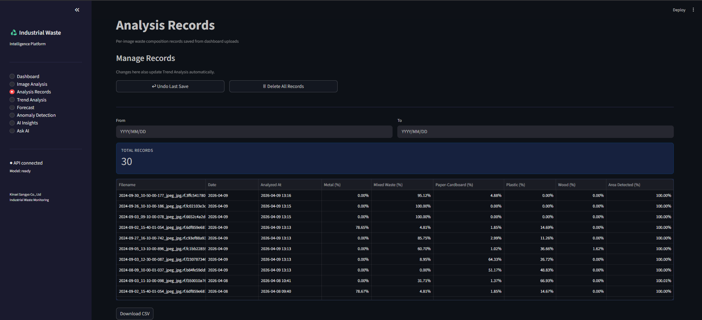

### Trend Analysis
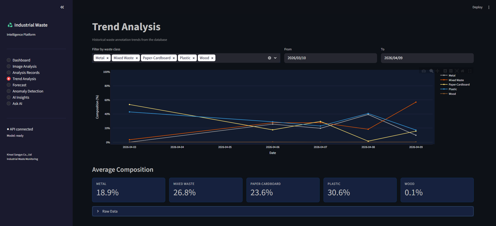

### Forecast
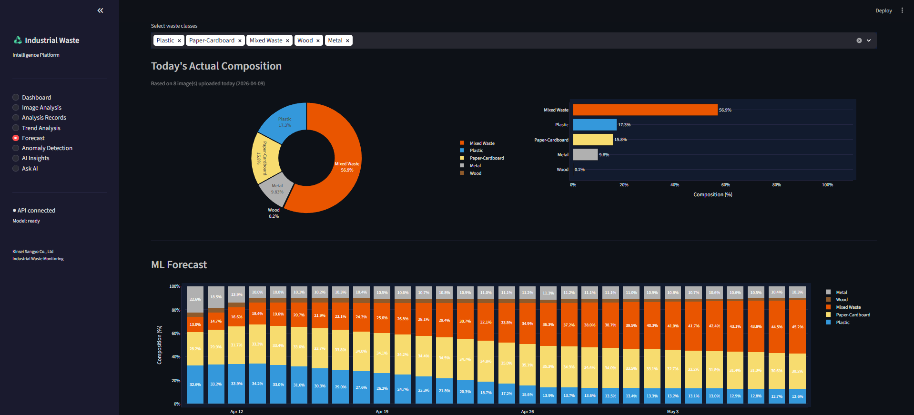

### Anomaly Detection
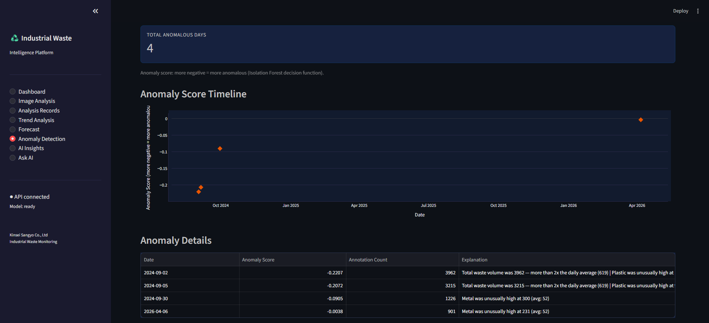

### AI Insights
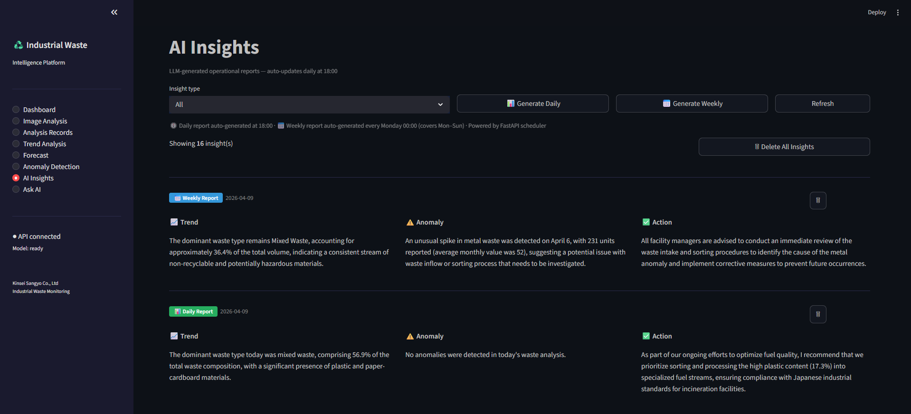

### Ask AI
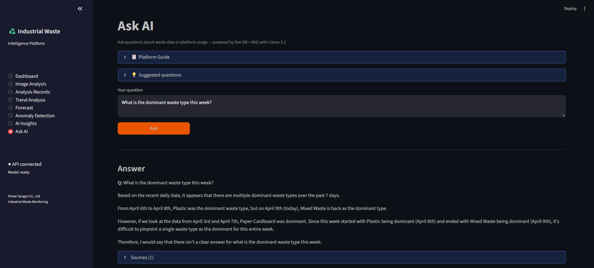

---

## Setup

### Prerequisites
- Docker Desktop
- Git

### Run with Docker (recommended)

```bash
git clone https://github.com/BhumipatSaengduan/industrial-waste-intelligence.git
cd industrial-waste-intelligence

# Copy and fill in your environment variables
cp .env.example .env

# Start all services
docker compose up -d

# Pull the LLM model (first time only, ~2GB)
docker compose exec ollama ollama pull llama3.2:3b
```

Open **http://localhost:8501** in your browser.

### Environment Variables (`.env`)

```env
DB_HOST=[your-cloud-sql-host]
DB_PORT=5432
DB_NAME=[waste_db]
DB_USER=[your-user]
DB_PASSWORD=[your-password]
GCS_BUCKET=[your-gcs-bucket]
```

### Run Locally (without Docker)

```bash
python -m venv venv
venv\Scripts\activate # Windows
pip install -r requirements.txt

# Install PyTorch with CUDA (local GPU)
pip install torch==2.6.0 torchvision==0.21.0 --index-url https://download.pytorch.org/whl/cu124

uvicorn src.api.main:app --host 0.0.0.0 --port 8001 --reload
streamlit run dashboard/streamlit_app.py
```

---

## Project Structure

```
industrial-waste-intelligence/
├── src/
│   ├── api/              # FastAPI application (endpoints, models, database)
│   ├── vision/           # Mask R-CNN inference engine
│   ├── ml/               # Forecast (XGBoost) + Anomaly Detection (Isolation Forest)
│   ├── llm/              # Ollama integration, RAG pipeline, prompt templates
│   └── pipeline/         # PySpark ETL (GCS → PostgreSQL)
├── dashboard/
│   └── streamlit_app.py  # Single-file Streamlit dashboard
├── models/
│   └── final/            # Trained Mask R-CNN weights
├── Dockerfile
├── Dockerfile.streamlit
├── docker-compose.yml
└── requirements.txt
```

---

## ML Models

### Computer Vision - Mask R-CNN
- Architecture: ResNet-50 FPN backbone (torchvision)
- Task: Instance segmentation - detects location, class, and pixel mask for each waste object
- Output: Annotated image (base64) + per-class composition percentage

### Forecasting - XGBoost
- Features: lag features (1, 7, 14 days), rolling averages, day-of-week
- Horizon: 30 days ahead
- Tracked with: MLflow (MAE, RMSE, R²)
- Classes: Plastic, Paper-Cardboard, Mixed Waste, Wood, and Metal

### Anomaly Detection - Isolation Forest
- Features: per-class daily counts + total count
- Contamination: 0.1 (10%)
- Output: anomaly score (more negative = more anomalous) + explanation text

---

## Limitations

- **Model accuracy** depends on training data quality and volume - more diverse images improve performance
- **Forecast reliability** requires at least 2–3 weeks of historical upload data
- **LLM reports** are generated by a 3B parameter local model - answers are reasonable but not expert-level
- **GPU not required** but inference is slower on CPU (Docker runs CPU-only)
- **No authentication** - designed for internal facility use on a private network

---

## Author

**Bhumipat Saengduan**
